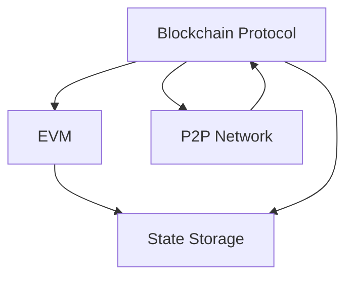
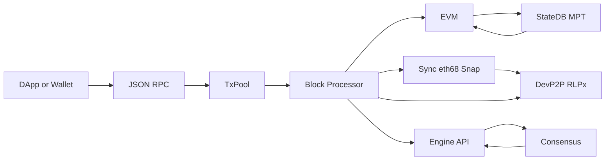
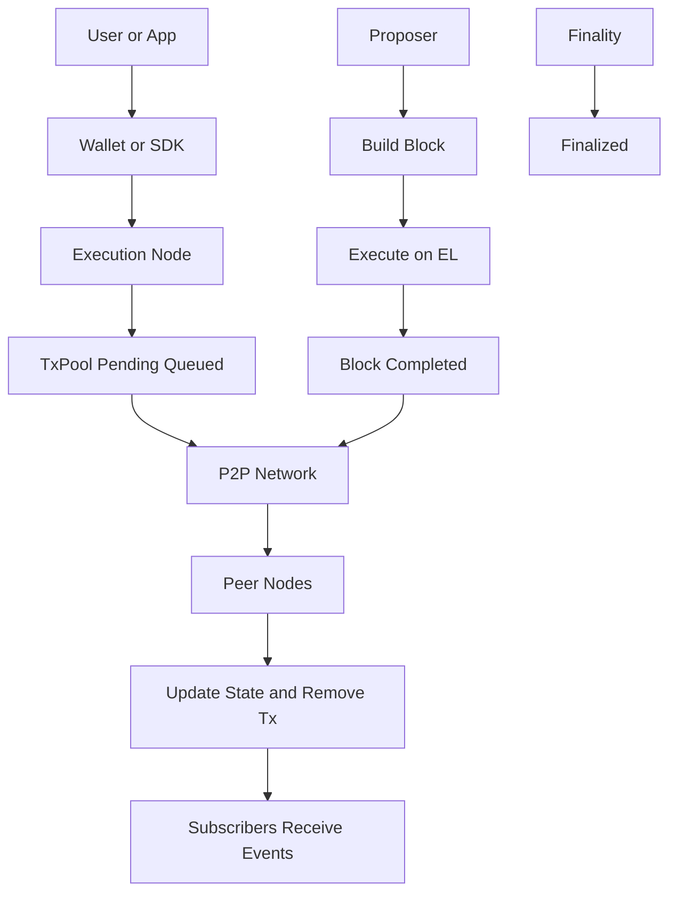

# 系统分层架构图

下图展示核心分层关系：EVM 执行层依赖状态存储层提供与落盘；区块链协议层驱动执行与状态更新，并通过 P2P 网络层完成数据传播与同步。



> 如果你的 Markdown 预览不支持 Mermaid，请参考下方 ASCII 版本（功能一致）：

```
            ┌────────────────────┐
            │    EVM 执行层      │
            └────────┬──────────┘
                     │  读写状态/收据
                     ▼
            ┌────────────────────┐
            │    状态存储层       │
            └────────────────────┘
                     ▲  提交状态根/索引
                     │
┌────────────────────┴────────────────────┐
│           区块链协议层 (eth/68)           │
│   - 驱动执行/区块导入                     │
│   - 交易/区块/收据传播与同步               │
└───────────────┬────────────────────────┘
                │  消息/连接
                ▼
        ┌────────────────────┐
        │     P2P 网络层     │
        └────────────────────┘
```

## 设计原则（为什么这样分层）
- 职责单一与可替换性：各层关注点分离，便于独立演进与优化（例如替换存储引擎、升级同步协议、优化 EVM）。
- 互操作与标准化：协议与网络遵循以太坊规范（eth/68、DevP2P/RLPx），确保跨客户端互通。
- 性能与可测试性：存储与执行隔离，便于独立压测与调优；协议层可并发/流水化处理同步与导入。
- 安全边界：最小化跨层耦合，降低攻击面（网络输入经协议校验后才进入执行与状态）。
- 可演进性：适配 EIP（如 EIP-1559）、新同步（Snap）、新网络策略，而不破坏其它层。

## 层间关系说明（与图对应）
- 协议层 → EVM：协议层在区块导入/打包时驱动交易与合约执行。
- EVM ↔ 状态：EVM 读取/写入世界状态并生成收据；状态层负责索引与落盘。
- 协议层 ↔ 状态：提交/校验状态根、交易/收据索引以完成区块验证与持久化。
- 协议层 ↔ P2P：通过 DevP2P/RLPx 进行区块/交易/收据的传播与同步；P2P 提供连接、会话与消息传输能力。

## 各层关键模块（以 Geth 为例）

- P2P 网络层（图中：P2P 网络层）
  - p2p、p2p/discover(v4/v5)、rlpx、node：节点发现、握手、会话与多路复用、消息编解码与传输。

- 区块链协议层（图中：区块链协议层）
  - eth/protocols/eth：执行层线协议（如 eth/68），区块头/体、交易、收据等消息。
  - eth/protocols/les：轻节点协议 LES（Light Ethereum Subprotocol），轻客户端按需拉取区块头、收据、状态证明；全节点可充当 LES 服务器。
  - eth/downloader：全/快/快照同步（Full/Fast/Snap），区块与状态数据获取与校验。
  - core/txpool：交易池管理与替换策略、打包优先级。
  - rpc：JSON-RPC 服务框架与方法暴露。
  - core/types：区块、交易、收据、日志等核心数据结构（被协议层与执行/存储层共同使用）。

- 状态存储层（图中：状态存储层）
  - trie：默克尔 Patricia 树实现（世界状态树/账户存储树），支持哈希化键、证明生成与验证。
  - core/state：StateDB 与状态读写/退款/日志记录等执行期状态管理。
  - rawdb、ethdb、ethdb/leveldb：链上数据的键空间与落盘接口/实现（默认 LevelDB，亦可替换后端）。

- EVM 执行层（图中：EVM 执行层）
  - core/vm：EVM 解释器、操作码、预编译合约、Gas 计费。
  - params：链配置与分叉规则（影响执行与计费）。
  - 与 core/types、core/state、trie 协同完成交易执行、收据生成与状态更新。

> 重点模块归属：
> - les：区块链协议层（eth/protocols/les）。
> - trie：状态存储层（trie）。
> - core/types：跨层通用的数据模型，核心服务于区块链协议层的数据交换与落盘。

## 以太坊功能架构图



> 若不支持 Mermaid，请参考 ASCII 版本：

```
DApp/Wallet --> JSON-RPC --> [TxPool] --> [区块处理/导入] --> [EVM] <--> [StateDB/MPT]
                                  |                              
                                  +------ 同步(eth/68,Snap) <--> P2P(DevP2P/RLPx)

[区块处理/导入] <--> Engine API <--> 共识层(提议/证明/最终性)
```

## 以太坊交易流程图



> ASCII 版本：

```
用户 ->(签名)-> 钱包/SDK -> eth_sendRawTransaction -> 执行层节点
  节点校验(签名/nonce/余额/gas) -> 交易池(Pending/Queued)
  交易池 ->(gossip)-> P2P
  共识提议者 ->(选交易)-> 构建区块 ->(Engine API)-> 执行层逐笔执行(EVM)
  执行完成 -> 生成收据/日志/状态根 -> 区块广播 -> 其他节点校验并回放 -> 更新状态/移除已上链交易
  共识层证明 -> 最终确定(Finalized) -> 应用订阅日志/回执获得结果
```

## 账户状态与存储模型

- 账户类型
  - 外部账户（EOA）：由私钥控制，无合约代码，`codeHash = 0x0`，`storageRoot = 空树根`。
  - 合约账户：包含字节码，维护独立的存储树。

- 账户对象结构（RLP 编码后存入世界状态树的叶子值）
  - `nonce`：账户已发送交易数（EOA）或创建合约计数（合约账户）。
  - `balance`：以 Wei 计的余额。
  - `storageRoot`：该账户（合约）的存储树根哈希。
  - `codeHash`：合约字节码的哈希；EOA 为空哈希。

- 世界状态树（World State）
  - 基于 Secure Merkle Patricia Trie（MPT）。
  - 键：`keccak256(address)`；值：`RLP(Account)`。
  - 区块头的 `stateRoot` 即该世界状态树的根。

- 合约存储树（Per-Contract Storage）
  - 每个合约账户拥有独立的 Secure MPT。
  - 键：`keccak256(slot)`（slot 为 32 字节槽位标识，映射/数组等经编译器计算到具体槽）。
  - 值：32 字节字（`bytes32`），表示该槽当前值（零值槽通常不持久化）。
  - 账户对象中的 `storageRoot` 指向该存储树根。

- 代码存储（Code Database）
  - 合约字节码不直接放在状态树；通过 `codeHash` 在底层数据库查询真实字节码。
  - 有利于去重与快速校验（哈希即内容地址）。

- 区块头三棵根
  - `stateRoot`：世界状态树根。
  - `transactionsRoot`：本区块交易列表的 MPT 根（按交易索引组织）。
  - `receiptsRoot`：本区块收据列表的 MPT 根（按交易索引组织）。

- 状态更新流程（执行期）
  1. EVM 执行产生对账户与存储的读写，写集进入 `StateDB` 的内存缓存（含脏页、日志和退款计数）。
  2. 交易结束结算 Gas 与退款，生成收据与日志（Logs）。
  3. 区块封装完成后，`StateDB.Commit` 将变更提交到 Trie，计算新的 `stateRoot` 并落盘到底层 KV（如 LevelDB）。

- 与 Geth 模块的对应关系
  - `trie/`：Secure MPT 的节点、路径、证明（proof）实现。
  - `core/state`：`StateDB` 封装，提供账户/存储读写、日志与退款管理、提交（Commit）。
  - `core/types`：`Account`、`Receipt`、`Log`、`Header` 等基础数据结构。
  - `rawdb`、`ethdb`、`ethdb/leveldb`：底层键值存储接口与实现；保存 Trie 节点、代码、区块与索引等。

- ASCII 结构示意（不依赖 Mermaid）

```
World State MPT (root = stateRoot)
  keccak(address A) -> RLP(Account{
      nonce, balance,
      storageRoot = Hs,
      codeHash = Hc
  })

Per-Contract Storage MPT (root = Hs)
  keccak(slot_0) -> 32-byte value
  keccak(slot_1) -> 32-byte value
  ...

Code DB
  Hc -> EVM bytecode
```
